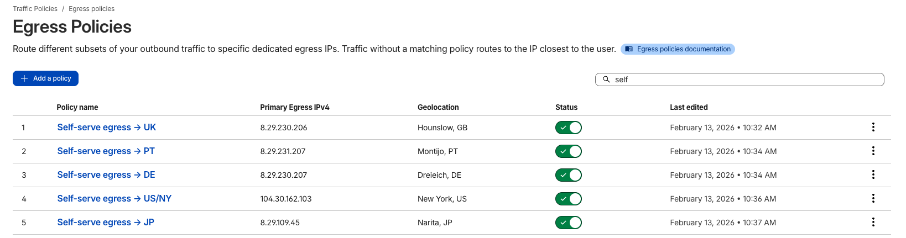
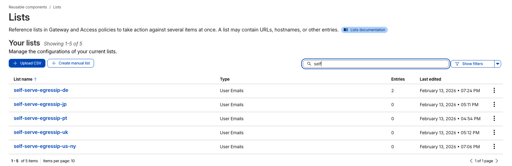

# Self-Serve Egress Location Selector

A Cloudflare Worker application that lets WARP users self-select their egress location by updating Zero Trust Gateway lists.

## Features

- **User self-service** — Authenticated users pick an egress location from a clean web UI at `selfservegress.jdores.xyz`
- **Admin dashboard** — Admins view all assignments and manually assign/remove users at `/admin`
- **Audit log** — All state-changing actions logged to D1 with 90-day retention, viewable in the admin Logs tab
- **Zero Trust integration** — Reads and updates Cloudflare Zero Trust Gateway lists via API (sole source of truth, no caching)
- **Location widget** — Shows the user's current observed location (city, country, IP) with a refresh button to confirm egress changes
- **Debug panel** — Collapsible footer panel shows user email and assignment details for troubleshooting
- **Workers Observability** — Invocation logs, console output, and errors captured in the Cloudflare dashboard

## How It Works

This app automates user assignment to Cloudflare Gateway **egress policies**. An admin pre-configures egress policies in the Cloudflare dashboard, each with:

- A **dedicated egress IP** at a specific geolocation (e.g., `8.29.230.206` in Hounslow, GB)
- An **identity filter** that matches users whose email is in a specific **Zero Trust list** (e.g., `self-serve-egressip-uk`)

When a user selects a location in the app, the Worker adds their email to the corresponding Zero Trust list via the Cloudflare API. This causes the user's WARP traffic to match the egress policy linked to that list, routing their traffic through the dedicated IP and geolocation. Users not on any list use the default Cloudflare egress (nearest IP).

| Egress Policy | Dedicated IP | Geolocation | Zero Trust List |
|---|---|---|---|
| Self-serve egress → UK | 8.29.230.206 | Hounslow, GB | `self-serve-egressip-uk` |
| Self-serve egress → PT | 8.29.231.207 | Montijo, PT | `self-serve-egressip-pt` |
| Self-serve egress → DE | 8.29.230.207 | Dreieich, DE | `self-serve-egressip-de` |
| Self-serve egress → US/NY | 104.30.162.103 | New York, US | `self-serve-egressip-us-ny` |
| Self-serve egress → JP | 8.29.109.45 | Narita, JP | `self-serve-egressip-jp` |

**Egress policies in the Cloudflare dashboard:**



**Policy detail — shows the identity filter (User Email in list) and egress IPs:**


**Zero Trust lists managed by the Worker:**



## Architecture

| Service | Purpose |
|---|---|
| **Workers** | Serves UI and API routes |
| **D1** (`selfservegress`) | Audit log (time-ordered, queryable) |
| **Cloudflare Access** | Authentication (configured manually) |
| **Zero Trust Gateway Lists API** | Sole source of truth for list membership |
| **Cron Trigger** | Daily cleanup of audit log entries older than 90 days |

## Routes

| Method | Path | Description |
|---|---|---|
| GET | `/` | User-facing egress location selector |
| GET | `/whoami` | Returns user's current location and IP (JSON) |
| POST | `/select` | Assign user to a location |
| POST | `/reset` | Reset user to default (no egress policy) |
| GET | `/admin` | Admin dashboard (reads live from API) |
| POST | `/admin/assign` | Admin assigns a user to a location |
| POST | `/admin/remove` | Admin removes a user from their location |
| GET | `/admin/logs` | Paginated audit log entries |

## Setup

### Prerequisites

- [Node.js](https://nodejs.org/) (v18+)
- [Wrangler CLI](https://developers.cloudflare.com/workers/wrangler/install-and-update/)
- A Cloudflare account with Zero Trust enabled
- Dedicated egress IPs provisioned for each location (requires Enterprise or add-on)

### 1. Configure egress locations

Before deploying, you must set up the egress policies and Zero Trust lists in the Cloudflare dashboard, then configure `wrangler.toml` to reference them.

**a) Create Zero Trust lists** — Go to Gateway > Lists and create one list per egress location (type: "User Emails"). For example: `self-serve-egressip-uk`, `self-serve-egressip-de`, etc.

**b) Create egress policies** — Go to Gateway > Egress Policies and create one policy per location. Each policy needs:
- A dedicated egress IPv4 and geolocation
- An identity filter: "User Email" → "in list" → the corresponding Zero Trust list from step (a)

**c) Update `wrangler.toml`** — Edit the `EGRESS_LOCATIONS` variable with each list's UUID and a human-readable name:

```toml
[vars]
EGRESS_LOCATIONS = '[{"id":"<list-uuid-1>","name":"United Kingdom"},{"id":"<list-uuid-2>","name":"Germany"}]'
```

Each `id` is the UUID of the Zero Trust list (visible in the dashboard or via the API). Each `name` is the label shown to users in the UI.

### 2. Install dependencies

```bash
npm install
```

### 3. Create D1 database

```bash
wrangler d1 create selfservegress
```

Copy the output `database_id` into `wrangler.toml` under `[[d1_databases]]`.

### 4. Initialize D1 schema

```bash
npm run db:init
```

### 5. Set secrets

```bash
wrangler secret put CF_ACCOUNT_ID
wrangler secret put CF_API_TOKEN
```

The API token needs **Zero Trust: Edit** permissions at the account level.

### 6. Configure Cloudflare Access

Manually create two Access applications:

1. **User app** — protects `selfservegress.jdores.xyz` for all authorized users
2. **Admin app** — protects `selfservegress.jdores.xyz/admin*` with a stricter policy

### 7. Deploy

Since `account_id` is not in `wrangler.toml` (it's a secret), set your account ID as an environment variable before deploying:

```bash
CLOUDFLARE_ACCOUNT_ID=your-account-id npm run deploy
```

Alternatively, Wrangler will prompt you to select an account interactively if the variable is not set.

## Development

This project has no external runtime dependencies. All HTML/CSS is generated inline by the Worker.

```
src/
├── index.ts               # Request router + cron handler
├── auth.ts                # JWT email extraction from Access header
├── api.ts                 # Zero Trust Gateway Lists API client + live state helpers
├── db.ts                  # D1 audit log helpers
├── handlers/
│   ├── user.ts            # User-facing route handlers
│   └── admin.ts           # Admin route handlers
├── ui/
│   ├── user-page.ts       # User page HTML template
│   └── admin-page.ts      # Admin page HTML template
└── types.ts               # TypeScript type definitions
```

## License

MIT
